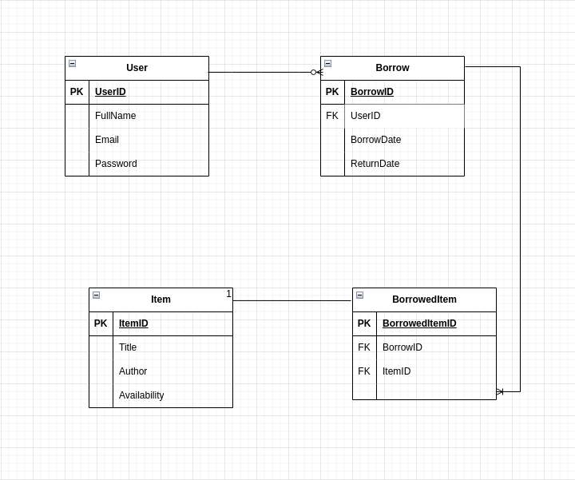
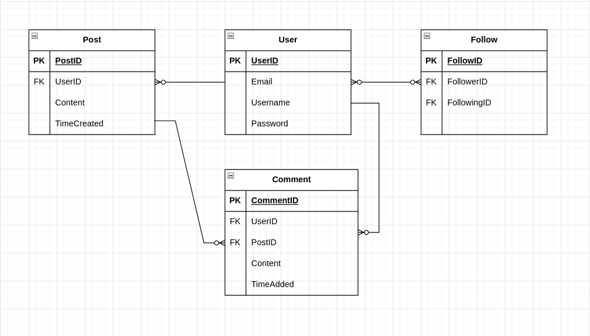

### Exercise 1

#### User stories

1. As a customer, I want to order candles and other artifacts from the local candle maker.
2. As an owner of a candle maker store, I want to keep track of all orders and customers that use my online store
3. As an owner of a candle maker store, I want all detailed information about a specific product or customer.
4. As an owner of a candle maker store, I want to update any information regarding a product.

#### Entity Relationship Diagram

 
### Exercise 2

#### User stories
1. As a customer, I want to book a table for my favourite restaurant.
2. As a customer, when booking I want to specify how many people our group will consist of.
3. As the restaurant's manager, I want to know the name and the phone number of each customer who does a reservation, and keep a detailed account of all reservations.
4. As the restaurant's manager, I want the customer to specify when they will arrive.
5. As a customer, I want to be able to book any available table that our group can fit at.

#### Entity Relationship Diagram

### Exercise 3

#### User Stories

1. As a user, I want to be able to register to the platform with an email and password, so that i can borrow books and other items.
2. As a user, I want to be able to search for books and other items available in the library, so that I can find the items I want to borrow.
3. As a user, I want to be able to view detailed information about a specific book or item, including its availability and location in the library, so that I can decide which items to borrow.
4. As a user, I want to be able to add up to 6 items to my borrowing cart, so that I can select multiple items to borrow at once.
5. As a user, I want to be able to view my borrowed items, including their due dates and any associated fines, so that I can manage my borrowed items effectively.

#### Entity Relationship Diagram

 

### Exercise 4

#### User Stories

1. As a user, I want to be able to create an account with a unique username and password.2. As a user, I want to be able to search for books and other items available in the library, so that I can find the items I want to borrow.
2. As a user, I want to be able to post short messages.
3. As a user, I want to be able to follow other users to see their posts.
4. As a user, I want to be able to edit or delete my posts.
5. As a user, I want to be able to edit or delete my comments.

#### Entity Relationship Diagram

 

### Exercise 5

#### User Stories

1. As the manager of the online system, I want to keep a detailed account of all Students using the platform.
2. As a student of the online system, I want to set up my account with my email and password, then log in to my account using either my username or email, and password.
3. As the manager of the online system, I want to keep a detailed account of all courses and update some of their information.
4. As a student, I want to enroll in courses.
5. As a teacher of the online system, I want to take attendance in the courses that i teach.
6. As the manager of the online system, I want to change who teaches each course.

#### Entity Relationship Diagram

