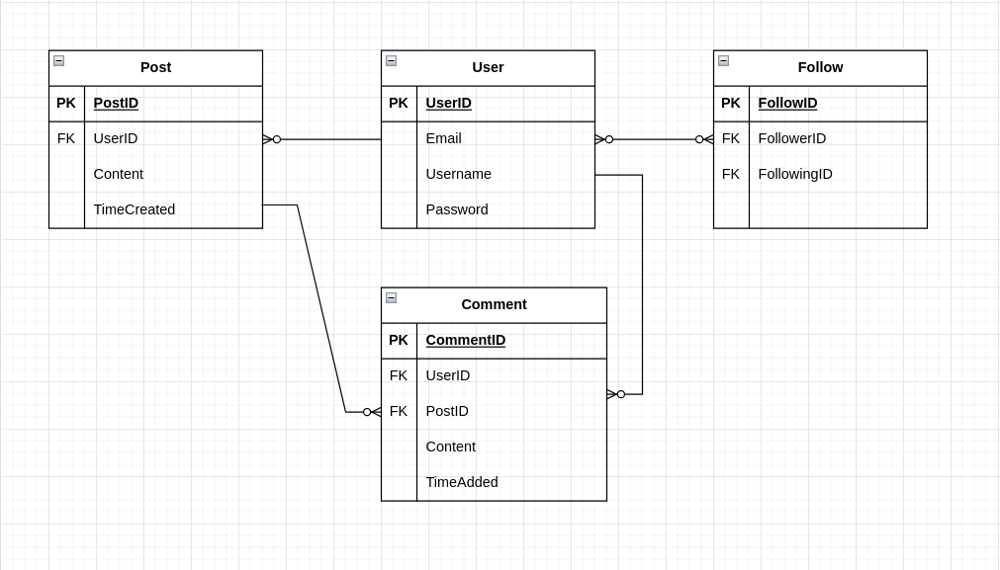

### Exercise 3

#### User Stories

1. As a user, I want to be able to register to the platform with an email and password, so that i can borrow books and other items.
2. As a user, I want to be able to search for books and other items available in the library, so that I can find the items I want to borrow.
3. As a user, I want to be able to view detailed information about a specific book or item, including its availability and location in the library, so that I can decide which items to borrow.
4. As a user, I want to be able to add up to 6 items to my borrowing cart, so that I can select multiple items to borrow at once.
5. As a user, I want to be able to view my borrowed items, including their due dates and any associated fines, so that I can manage my borrowed items effectively.

#### Entity Relationship Diagram

 

### Exercise 4

#### User Stories

1. As a user, I want to be able to create an account with a unique username and password.2. As a user, I want to be able to search for books and other items available in the library, so that I can find the items I want to borrow.
2. As a user, I want to be able to post short messages.
3. As a user, I want to be able to follow other users to see their posts.
4. As a user, I want to be able to edit or delete my posts.
5. As a user, I want to be able to edit or delete my comments.

#### Entity Relationship Diagram

