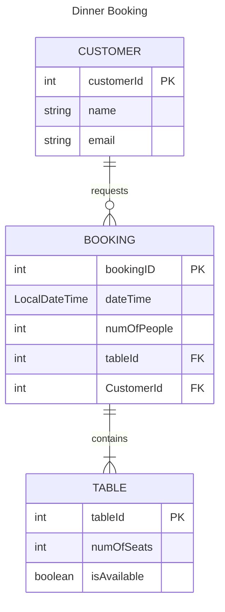

# Entity Relationship Diagrams

ER-diagrams using [Mermaid.js](https://mermaid.js.org/syntax/entityRelationshipDiagram.html).

## Core

```mermaid
---
    title: Dinner Booking
---
erDiagram
    CUSTOMER ||--o{ BOOKING : requests
    CUSTOMER {
        int customerId PK
        string name
        string email
    }
    BOOKING ||--|{ TABLE : contains
    BOOKING {
        int bookingID PK
        LocalDateTime dateTime
        int numOfPeople
        int tableId FK
        int CustomerId FK
    }
    TABLE {
        int tableId PK
        int numOfSeats
        boolean isAvailable
    }
```