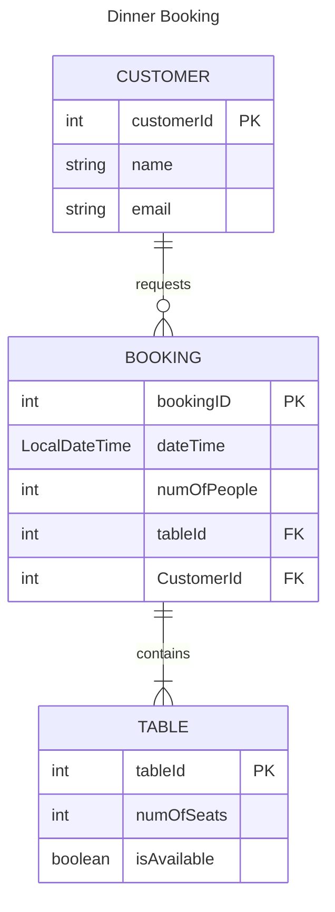
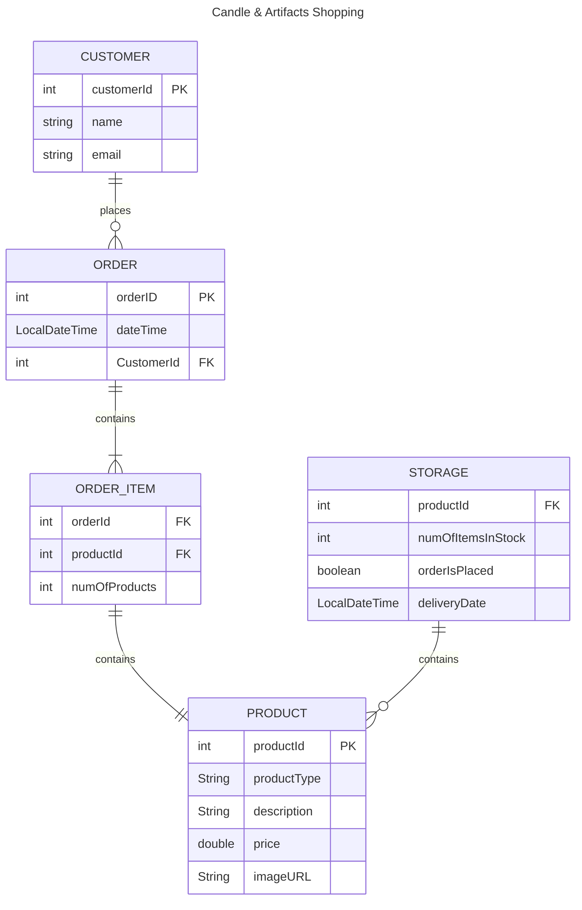

# Entity Relationship Diagrams

ER-diagrams using [Mermaid.js](https://mermaid.js.org/syntax/entityRelationshipDiagram.html).

## Core Exercise - Restaurant Booking System

## Extension Exercises

### 1. Local Candle Maker
#### User Stories
- As a customer, so I can order candles and artifacts, I want to place an order in the online shop.
- As the Candle Shop owner, so that I can manage my business effectively I want to be able to add and update products of a given product type.
- As the Candle Shop owner, so that I can re-stock products, I want to be able to see the number of items in stock.
- As the Candle Shop owner, so I can notify customers when items are back in stock, I want to be able to see the delivery status of the products.

