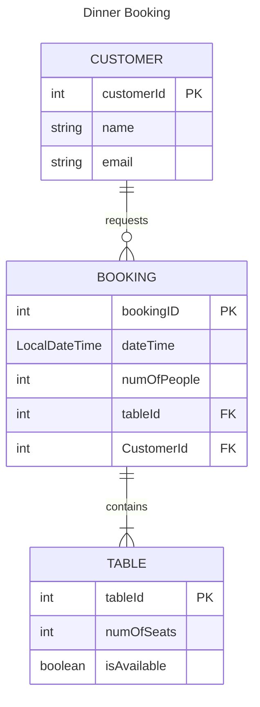
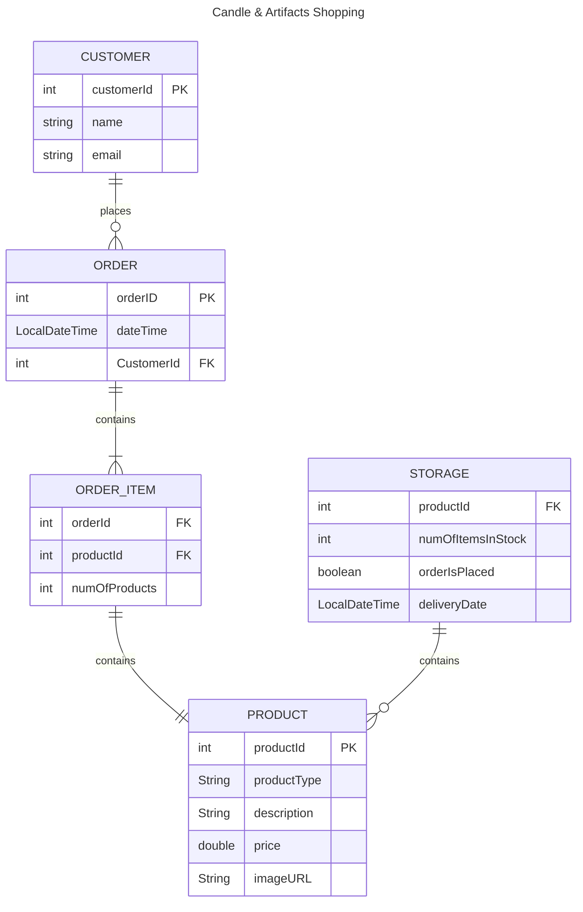
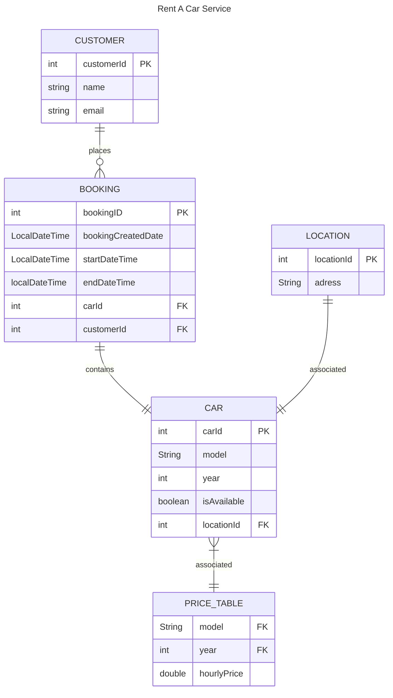
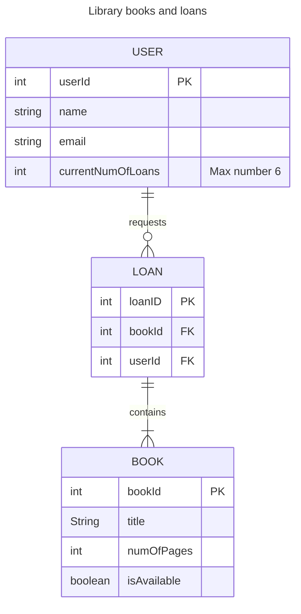
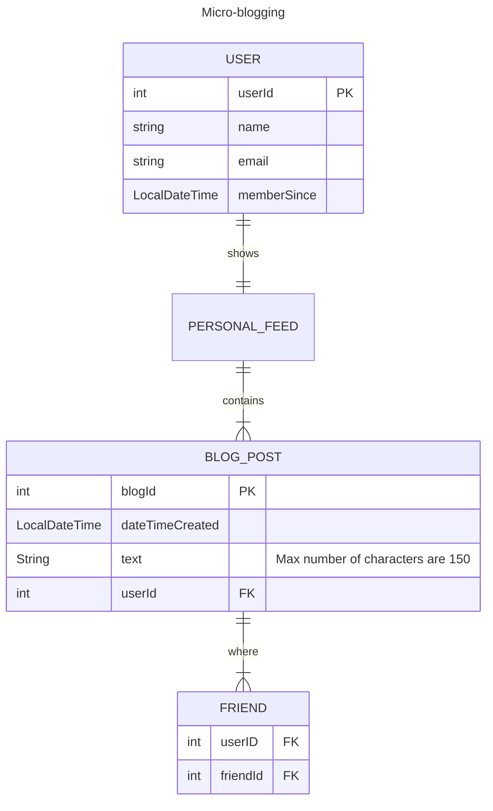
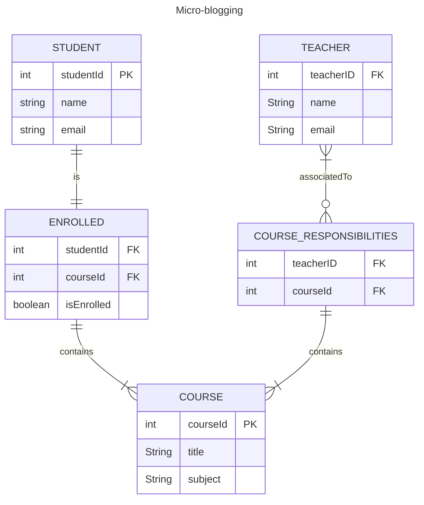

# Entity Relationship Diagrams

ER-diagrams using [Mermaid.js](https://mermaid.js.org/syntax/entityRelationshipDiagram.html).

## Core Exercise - Restaurant Booking System

## Extension Exercises

### 1. Local Candle Maker
#### User Stories
- As a customer, so I can order candles and artifacts, I want to place an order in the online shop.
- As the Candle Shop owner, so that I can manage my business effectively I want to be able to add and update products of a given product type.
- As the Candle Shop owner, so that I can re-stock products, I want to be able to see the number of items in stock.
- As the Candle Shop owner, so I can notify customers when items are back in stock, I want to be able to see the delivery status of the products.

### 2. Car Hire Company
#### User Stories
- As a customer, so I can go for a trip with my family, I want to hire a car in my hometown.
- As a customer, so I don't need to bring my own car to my vacation, I want to know if there is a car available nearby my hotel.
- As the Car Company owner, so that I can manage my business effectively I want to be able to manage the hourly price for renting a specific car model.

### 3. University Library
#### User Stories
- As a user, so I borrow books, I want to see available books.
- As the Library administrator, so that I can manage the loans effectively, I want to be able to update the max number of books users can borrow.

### 4. Social Media Site
#### User Stories
- As a user, so I can see what my friends are doing, I want to see my personal feed.
- As the Site owner, so that I can manage the business effectively, I want to be able to decide what a user will see in the personal feed.

### 5. Online Learning
#### User Stories
- As a student, so I can get access to the course material, I want to see when I'm enrolled in a course.
- As a head teacher, so that I can manage the school effectively, I want to see the teacher responsible for different courses.
- As a teacher, so that I can give feedback to students, I want to be able to grade students en every course I'm responsible for.

