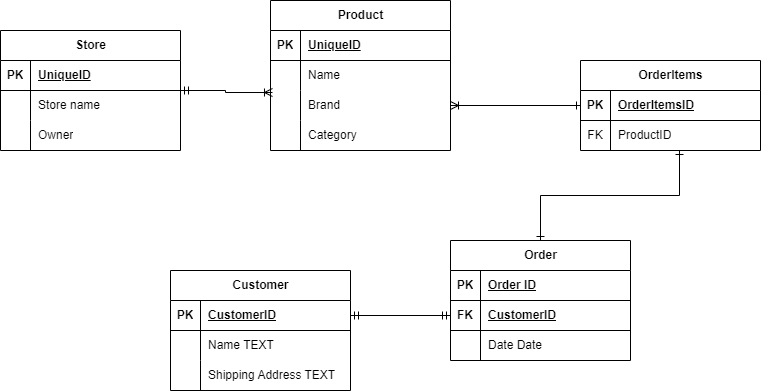

## Extension 1.
 - As a customer, I want to order products from the website
 - In the store, Products should be stored and be able to update depending on the ID of the item.
 - As a store owner, I want to see customer orders
 - As a store owner, I want to get a customers name, shipping address, and ID.

## Extension 2

 - As a consumer, I want to book a car.
 - As a customer, I want to be able to book a car from one location and leave it at another location
 - As a customer, I want to have a start date and a end date.
 - As a manager, I want to see all the current bookings.

## Extension 5

 - As a teacher, I want see my students in my class
 - As a teacher, I want to upload exercises for the students to see
 - As a student, I want to submit my paper/exercise to the school platform.
 - As a teacher, I want to grade the paper from F-A.
 - As a student, I want to see what grade I got on my paper.

