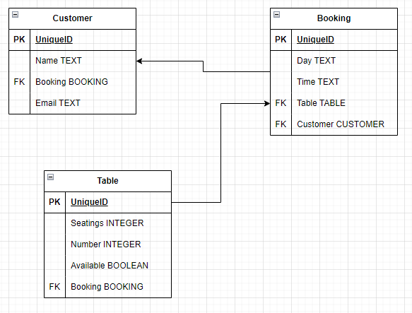
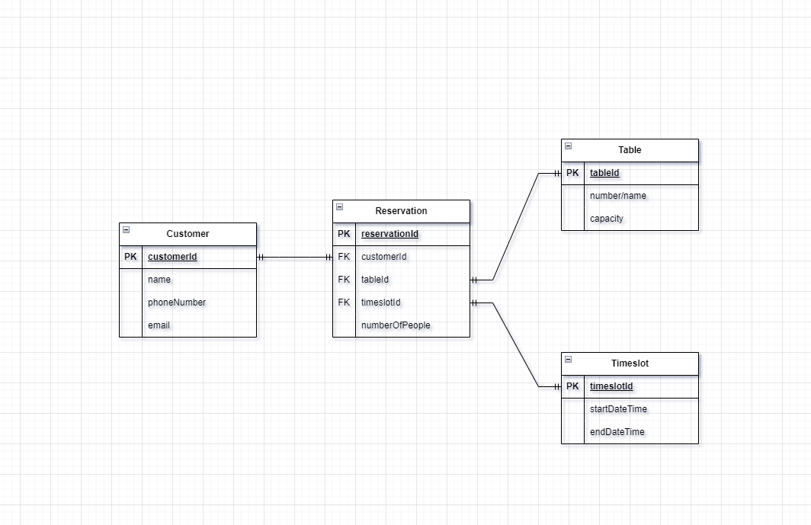
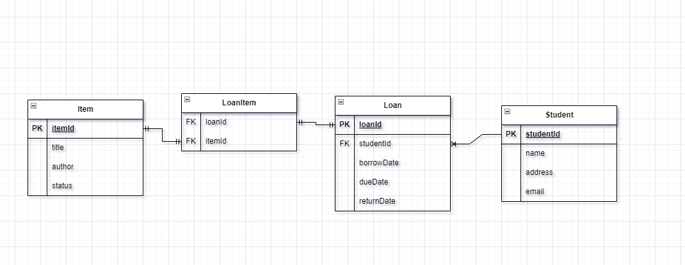
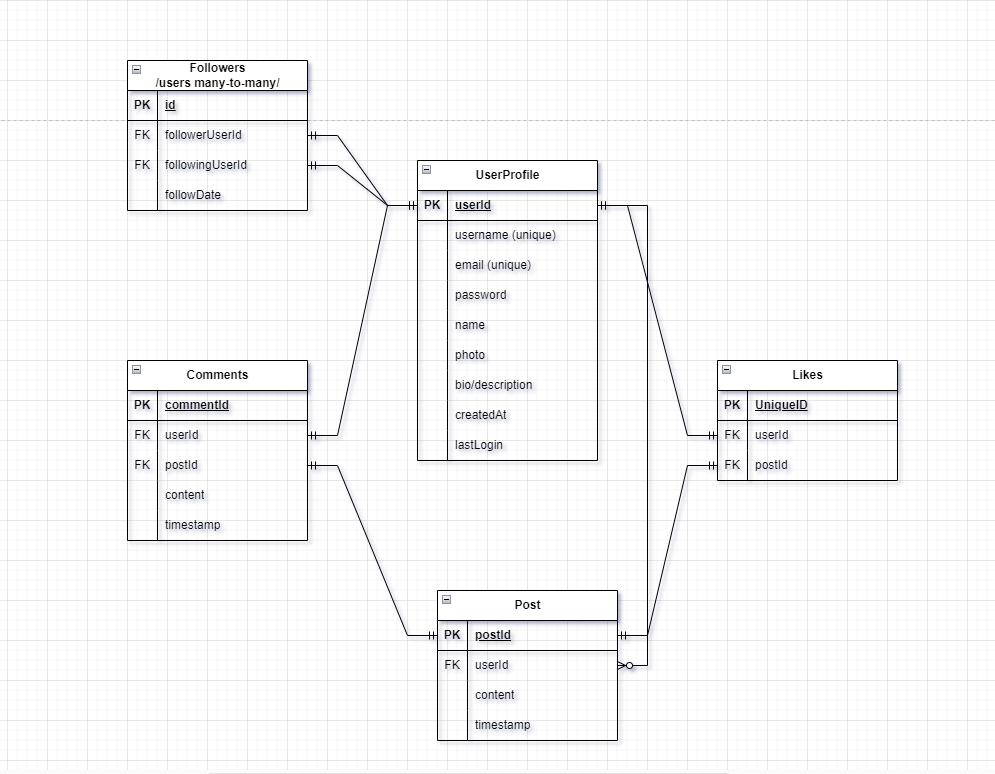

# Java Data Modelling Exercise

## Learning Objectives
- Explain that an Entity Relationship Diagram is used to visualise and define the implementation of a database
- Use user stories to design conceptual data models
- Use conceptual data models to design logical data models
- Use logical data models to design physical data models

## Instructions

Fork the repo as normal.

Create the Entity-Relationship Diagrams using whichever tool you feel works best for you.

Once you have a solution for each activity add it to this repo as an image.

Push your repo once you have completed the activities and create a Pull Request as normal.

## Core Exercise - Restaurant Booking System

#### Epic

”A restaurant wants to introduce an online booking system for their main dining room, which has various tables. The restaurant is open throughout the day so customers can book for a variety of times and dates for different size groups."

#### User Stories
- As a customer, so I can have a meal tomorrow night, I want to book a table at the restaurant.
- As the restaurant owner so that I can manage my business effectively I want to be able to alter the number of tables available at a given time.
- As a customer, so I can invite different groups of people to eat with me, I want to book tables of different sizes.
- As the restaurant owner, so I can serve many customers a day, I want the customers to book tables in specific time slots.

Design a simplified booking system for this epic.

#### Entity Relationship Diagram Core

## Extension Exercises

Come up with User Stories (and possibly a more detailed Epic) for each of the following scenarios. 

Then design the database tables and relationships which would be needed to implement them.

1. A local candle maker wants to open an online store selling their handmade candles and other artifacts, they need a database system to use as part of this online shop. Details of customers need to be stored, products need to be stored and updated, a record of customer orders also needs to be maintained. Design the database system for the Candle Shop.

2. A car hire company with multiple locations wants to design an online system that will allow customers to book various cars, on various dates from different locations. Design the database system that would allow them to effectively manage their business.

3. A University library wishes to implement an online system for borrowing books and other items from the library. Each user will be able to borrow up to 6 items at a time.

4. When they originally launched Social Media sites such as Twitter, Identica, Diaspora and Mastodon all described themselves as micro-blogging sites, design a database schema for a similar micro-blogging Social Media site.

5. Think about an online learning system as used by a school, a university or a coding bootcamp, design the database tables etc that might be required to implement such a system.

### Extension 1: Candle Shop

#### User Stories
- As the candle maker, so that I can make money of my candle making hobby, I want to be able to sell my homemade stuff to a larger audience with an online shop.
- As a customer, so that I can order homemade candles, I want to be able to buy a specific amount of each artifact.
- As the candle maker, so that customers don't place orders of artifacts not in stock, I want the list of products to be updated.
- As the candle maker, so that I know which order belongs tho which customer, I want the order to include the customer.

#### Entity Relationship Diagram

### Extension 2: Car Rental

#### User Stories
- As a car hire manager, so that I can manage my car park, I want a booking to include a car, date and location.
- As a customer, so that I can bring the baggage I need, I want to be able to rent cars of different sizes.

#### Entity Relationship Diagram

### Extension 3: Library

#### User Stories
- As a librarian, so that my library don't run out of books, I want the users to be able to borrow up to 6 items at a time.
- As a user of the library, so that I can read a good book during my vacation, I want to reserve a book ahead of time.
- As a librarian, so that I can keep track of different borrowings, I want to know which user have borrowed the item and for how long the item is unavailable for further loans.
- As a librarian, so that as many people as possible get the opportunity to borrow a specific book, I want every borrowing to have a submission deadline.

#### Entity Relationship Diagram

### Extension 4: Micro-blogging Site

#### User Stories
- As a user, so that I can express myself on a micro-blogging site, I want to create posts.
- As a user, so that I can find out how popular I am, I want to be able to see how many likes my posts have gotten.
- As a user, so that I can discuss posts, I want to be able to make comments to posts.
- As a user, so that I can keep track of what my friends posts about, I want to be able to follow other users.
- As a user, so that I can save a post I thought was great for later, I want to favorite the post.

#### Entity Relationship Diagram

