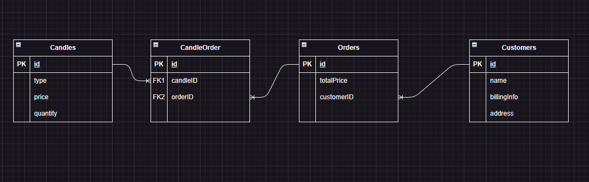
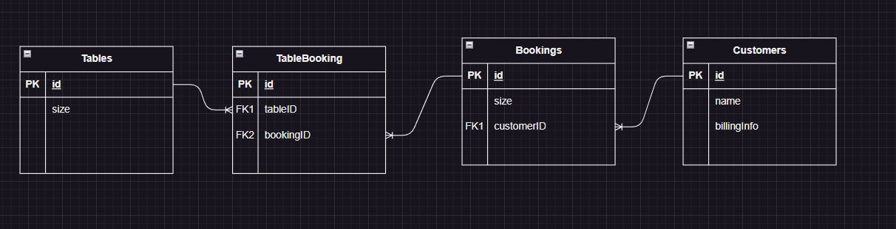
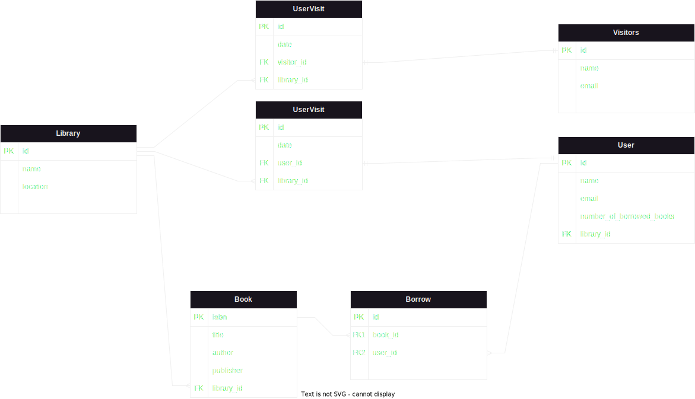
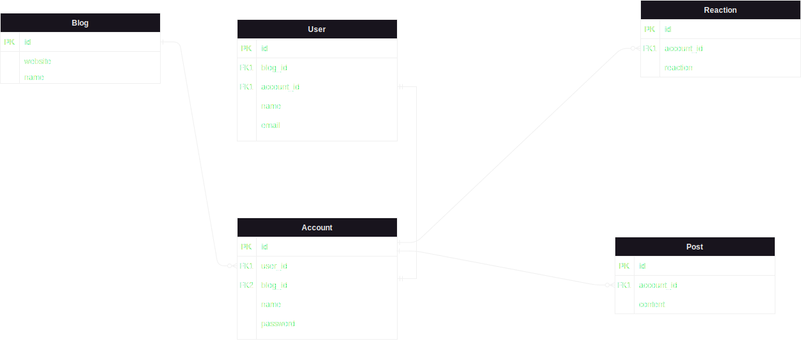
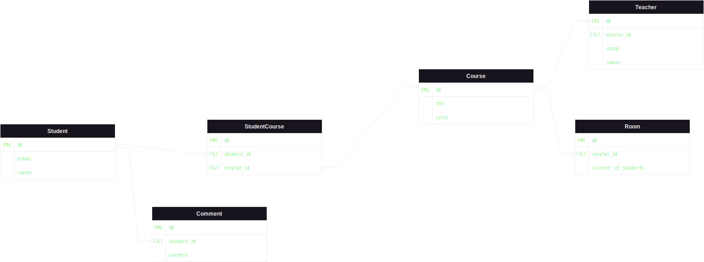

1. A local candle maker wants to open an online store selling their handmade candles and other artifacts, they need a database system to use as part of this online shop. Details of customers need to be stored, products need to be stored and updated, a record of customer orders also needs to be maintained. Design the database system for the Candle Shop.

- As a customer, so I can get a handmade candle, I want to make an order at the shop.
- As the shop owner, so I can full-fill orders, I need a place to hold them.
- As the shop owner, so I can see who is buying from me, I need to keep a tab for my customers.

##

2. A restaurant wants to introduce an online booking system for their main dining room, which has various tables. The restaurant is open throughout the day so customers can book for a variety of times.

- As a customer, so I can eat at this restaurant, I want to be able to book a table.
- As the restaurant owner, so I can see who is booking tables, I need to hold bookers information.
- As the restaurant owner, so I can see which tables are booked, I need to hold information about bookings.

##

3. A University library wishes to implement an online system for borrowing books and other items from the library. Each user will be able to borrow up to 6 items. Users need to return at least one of the borrowed items to borrow a new one.

- As a library, so that i can gain popularity, i want people to able to visit without restrains.
- As a library, i want users to be able to borrow books.
- As a library, so that i can keep track of the borrowed items, i want only registered users to be able to borrow books.
- As a library, so that there are items for visitors to see/read, i want user to be able to borrow up to 6 items.
- As a user, so i can borrow a new item, i need to return an already borrowed item.

##

4. When they originally launched Social Media sites such as Twitter, Identica, Diaspora and Mastodon all described themselves as micro-blogging sites, design a database schema for a similar micro-blogging Social Media site.

- As the blog manager, so that the blog becomes popular, i want people to be able to visit without restrains.
- As the blog manager, so that i can keep track of the site's popularity, i want people to be able to create an account.
- As the blog manager, to draw the attention of more people, i want people to be able to post things.
- As the blog manager, to make people visit frequently, i want people to be able react to posts.
- As the blog manager, to control and prevent harassment, i want only registered people to be able to react on posts.

##

5. Think about an online learning system as used by a school, a university or a coding bootcamp, design the database tables etc that might be required to implement such a system.
- As an online learning system manager, so i can make money, i want students to be able to register.
- As an online learning system manager, to draw the attention of students, i want them to choose from a variety of courses.
- As an online learning system manager, to increase the popularity of the platform, i want people to make comments on the subject that is being taught.
- As an online learning system manager, to make students feel comfortable, i want to have many rooms.
- As an online learning system manager, to make satisfy the needs of all students, i want to have many teachers for the course.
- As an online learning system manager, to avoid students quiting some courses, i want them to be able to change rooms.

