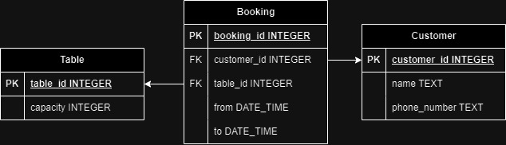
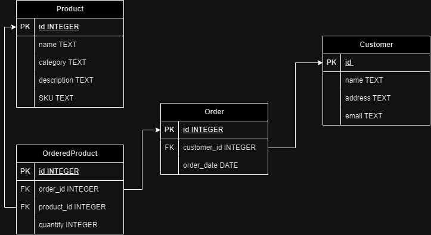
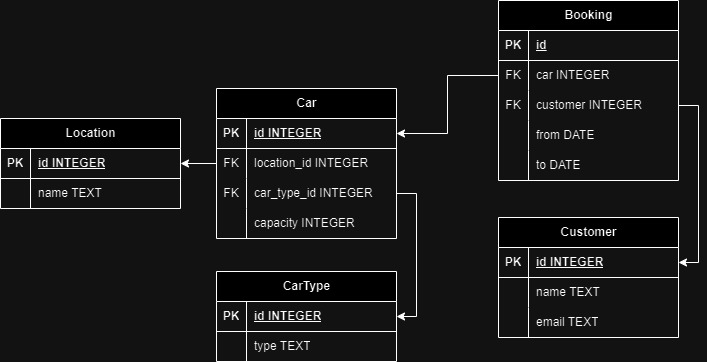
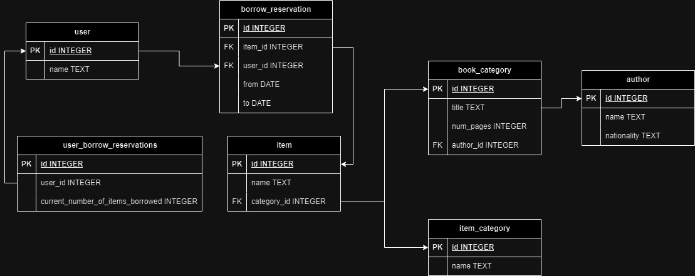
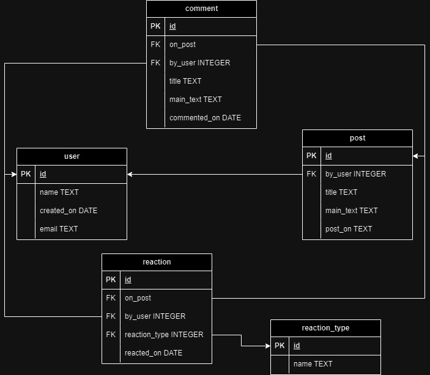
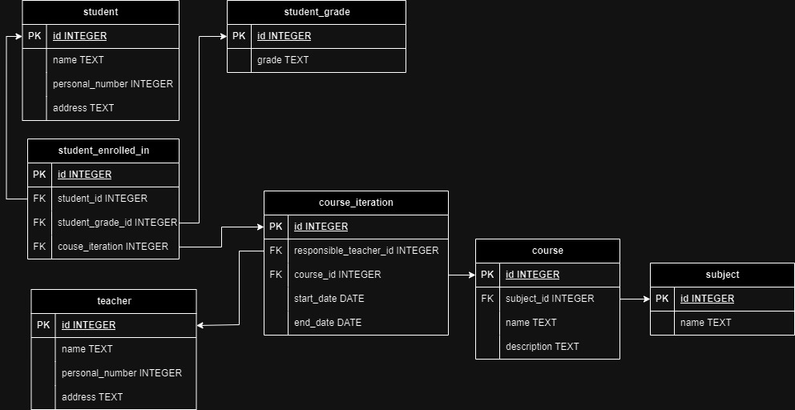

# Models

## Restaurant

## Online candle store

"A local candle maker wants to open an online store selling their handmade candles and other artifacts, they need a database system to use as part of this online shop. Details of customers need to be stored, products need to be stored and updated, a record of customer orders also needs to be maintained. Design the database system for the Candle Shop."

- As a customer, so I can light some candles, I want to be able to order candles and other artifacts.
- As the online store owner, so I can keep track of and be able to contact my customers, I want to be able to store details of my customers.
- As the online store owner, so I can keep track of and manage orders, I want to be able to list all orders.

## Car hire company

"A car hire compnay [sic] with multiple locations wants to design an online system that will allow customers to book various cars, on various dates from different locations. Design the database system that would allow them to effectively manage their business."

- As a customer, so that I can get to one place to another, I would like to book a car at a specific location and date.
- As a customer, so that I can choose a car that fits my needs, I would like to be able to choose between various cars to book.

## University library

"A University library wishes to implement an online system for borrowing books and other items from the library. Each user will be able to borrow up to 6 items at a time."

- As a library visitor, so that I do not have to buy anything, I would like to make a reservation for borrowing books and other items.
- As a library manager, so that the visitors do not over-borrow, I would like to view how many borrowed items the visitors currently have and make sure they do not borrow more than 6 items simultaneously.

## Social media

"When they originally launched Social Media sites such as Twitter, Identica, Diaspora and Mastodon all described themselves as micro-blogging sites, design a database schema for a similar micro-blogging Social Media site."

- As a user, so that I can keep update my followers, I would like to make status posts.
- As a user, so that I can share my ideas on a post, I would like to be able to comment on a post.
- As a user, so that I can share my reactions to a post, I would like to make a reaction to a post (like, laugh, or love).

## School course system

"Think about an online learning system as used by a school, a university or a coding bootcamp, design the database tables etc that might be required to implement such a system."

