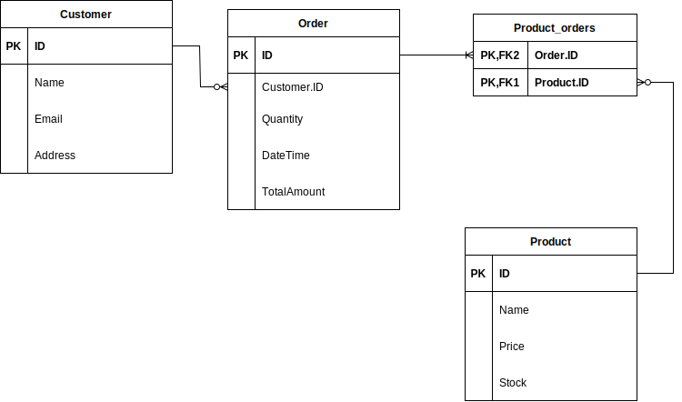

# Local candle maker store
### Epic
A local candle maker wants to open an online store selling their handmade candles and other artifacts, they need a database system to use as part of this online shop. Details of customers need to be stored, products need to be stored and updated, a record of customer orders also needs to be maintained. Design the database system for the Candle Shop.

### User stories

- As a store owner, so I can view my products , I want to store their details
- As a store owner, so I can update my products , I want to change their details
- As a store owner, so I can identify my customers, I want to keep their details
- As a store owner, so I can manage customer's orders, I want to know which customer made each order

