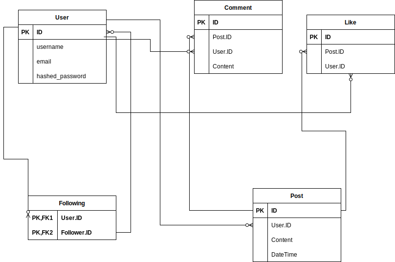

# Micro Blogging
### Epic
When they originally launched Social Media sites such as Twitter, Identica, Diaspora and Mastodon all described themselves as micro-blogging sites, design a database schema for a similar micro-blogging Social Media site.

### User stories

- As a user, I want to create a new account on the micro-blogging site, providing my username, email, and password.
- As a user, I want to post messages, sharing my thoughts or updates with my followers.
- As a user, I want to follow other users, so that I can stay updated with their posts.
- As a user, I want to like, comment on a post , engaging in conversations and sharing content with my followers.

## E/R diagram

