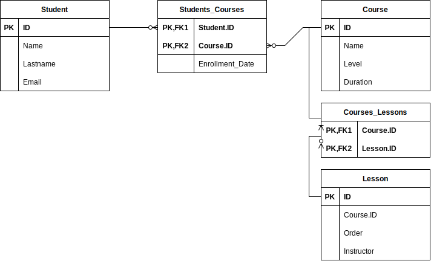

# Local candle maker store

## Epic

Think about an online learning system as used by a school, a university or a coding bootcamp, 
design the database tables etc. that might be required to implement such a system.

## User stories

- As a student, I want to browse and search for available courses, filtering by subject, level or instructor, so that I can find the courses that align with my learning goals.
- As a student, I want to enroll in courses of my choice, adding them to my learning profile and accessing the course lessons.
- As a student, I want to track my progress within each course, viewing completed lessons.
- As an instructor, I want to create and manage courses, organizing content.
- As an administrator, I want to generate reports on student enrollment, course completion rates, to assess the effectiveness of the online learning system.

## E/R diagram

