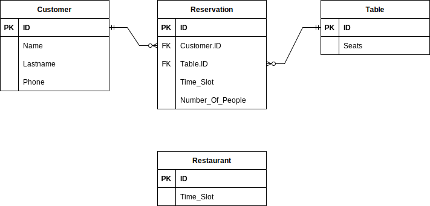

# Restaurant Booking System

## Epic

A restaurant wants to introduce an online booking system for their main dining room,
which has various tables. The restaurant is open throughout the day so customers can book for a variety of times.

## User Stories

- As a customer, so that I can choose a convenient time for my reservation, I want to view the available time slots for booking a table.
- As a customer, so that I can choose the appropriate table, I want to select the number of people in my dining party when making a table reservation.
- As a customer, I want to provide my contact details when making a table reservation, so that the restaurant can confirm my booking and communicate any updates.
- As a restaurant staff member, I want to manage and update the table availability in real-time, so that I can efficiently accommodate customer reservations.

## E/R diagram

