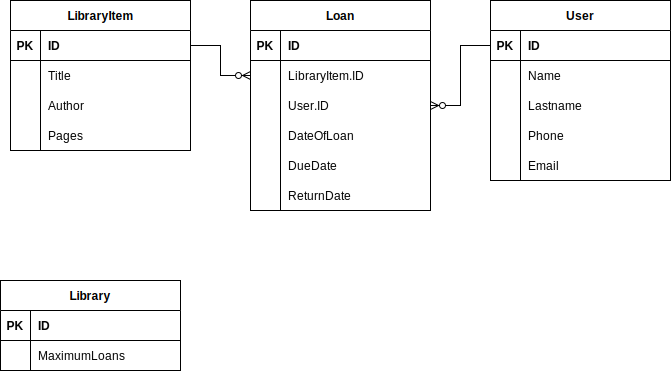

# University Library
### Epic
A University library wishes to implement an online system for borrowing books and other items from the library. Each user will be able to borrow up to 6 items at a time.

### User stories

- As a user, I want to search for books and other library items based on title, author, or keywords, so that I can find the resources I need for my studies.
- As a user, I want to check the availability of a specific library item, so that I can plan my borrowing accordingly.
- As a user, I want to borrow up to 6 library items at a time, providing my user ID and contact information.
- As a librarian, I want to track the borrowing history of each user, including the due dates and any late returns, to ensure fair usage of library resources.

`user can be a university student or professor`

## E/R diagram

