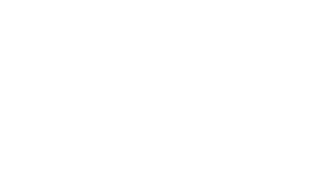
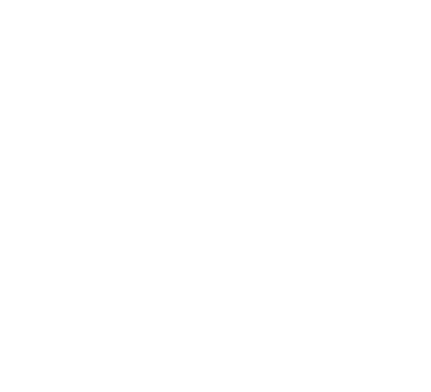
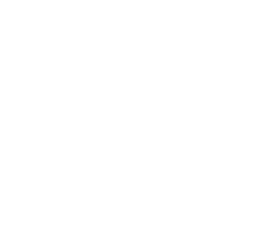
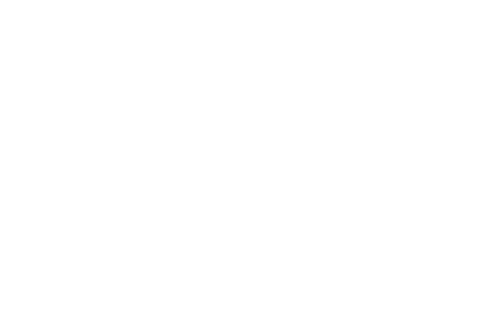
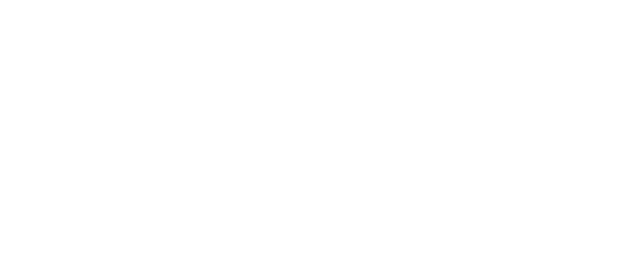

# Core Exercise - Restaurant Booking System
```
Customer booking is for a number of people, which is then assigned one to multiple tables.
```
### ER Diagram


# Extension Exercises
## Candle Maker
A local candle maker wants to open an online store selling their handmade candles and other artifacts, they need a database system to use as part of this online shop. Details of customers need to be stored, products need to be stored and updated, a record of customer orders also needs to be maintained. Design the database system for the Candle Shop.

### User Stories
```
1. 
As a customer,
to ease the use of this online store,
I want my details to be saved for the next time I am shopping

2.
As the owner,
So that i can add and update products in my shop
I need the products to be stored in the database

3.
As a customer,
So that i can see what i have bought previously
I want my orders to be saved so that i can see them again later
```

### ER Diagram



## Car Hire Company
A car hire compnay with multiple locations wants to design an online system that will allow customers to book various cars, on various dates from different locations. Design the database system that would allow them to effectively manage their business.

### User Stories
```
1. 
As a customer,
So that i can drive a car when i need to,
I would like to be able to book a car

2.
As a customer,
So that i can book a car when i am not in my home city
I would like to be able to book a car at different locations

3.
As a customer,
So that i can book different cars
I want there to be multiple cars available for driving
```

### ER Diagram



## University Library
A University library wishes to implement an online system for borrowing books and other items from the library. Each user will be able to borrow up to 6 items at a time.

### User Stories
```
1. 
As the librarian,
So that i can keep track the borrowers
I want to keep track of the students details

2.
As the librarian,
So that i can keep track of everything in the library
I want all the items to be added to the system

3.
As a student,
So that im not too limited when borrowing
I want to be able to borrow up to 6 items

Assumption:
- Each Item in the library is unique
```

### ER Diagram



## Online Learning
Think about an online learning system as used by a school, a university or a coding bootcamp, design the database tables etc that might be required to implement such a system.

### User Stories
```
1. 
As a student
So that i can take classes and learn cool stuff
I want to be able to enroll in a course

2.
As a teacher
So that i can teach my passion to young learners
I want to be able to teach multiple subjects

3.
As the principal,
So that teachers can reach MORE students (and save $)
I want the subjects to be able to be part of multiple courses

Assumptions:
 - Students can only be part of one course
 - Each Subject has one Teacher
```

### ER Diagram

